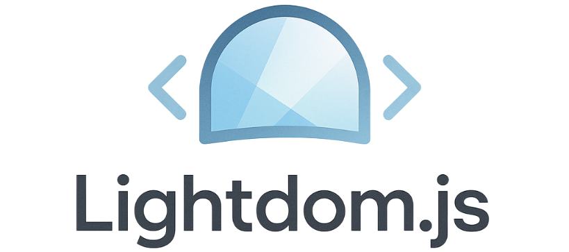

<p align="center">
  
  
  
  
  
</p>


---


## 📑 Table of Contents

- [About](#-about)
- [Features](#-features)
- [Project Structure](#-project-structure)
- [Getting Started](#-getting-started)
- [Usage Example](#-usage-example)
- [Plugins](#-plugins)
- [Learn More](#-learn-more)
- [License](#-license)
- [Contributing](#-contributing)
- [Thanks](#thanks)

---

## 🚀 About

Lightdom.js is a lightweight, simple JavaScript frontend framework built from scratch.  
Designed to help you learn framework internals and build small projects with ease.

> If you like the project consider following my github profile and starring the repo, it would help a lot! :)

---

## ⚙️ Features

- Custom `createElement` function for building virtual DOM objects  
- Declarative component system with `defineComponent`  
- Simple DOM renderer with event binding  
- Reactive state with `reactive()` proxy  
- Easy app mounting with `createApp`
- Lifecycle hooks
- Plugins

---

## 📁 Project Structure

```text
Lightdom.js/
├── benchmarks
│   └───────renderspeed.js
├── config/
│   │─────── project.info.json
│   └─────── version.txt
├── plugins/
│   │─────── logger.js
│   │─────── README.md
│   │─────── router.js
│   │─────── storage.js
│   │─────── themetoggle.js
│   │─────── autoresizer.js
│   │─────── banner.js
│   │─────── scrolltotop.js
│   └─────── animation.js
├── docs/
│   │──── api.md
│   │──── examples.md
│   │──── faq.md
│   └──── getting-started.md
├── public/
│   │──── index.html
│   └── styles/
│       └──styles.css
├── src/
│   ├── core/
│   │   ├── app.js
│   │   ├── component.js
│   │   ├── createElement.js
│   │   ├── reactive.js
│   │   ├── render.js
│   │   ├── lifecycle.js
│   ├── components/
│   │   └── HelloButton.js
│   └── main.js
├── .gitignore
├── README.md
├── LICENSE
└── CHANGELOG.md
```

---

## 💻 Getting Started

### Prerequisites

- Node.js & npm (optional, if you want to use `serve` or other tools)  
- VS Code or your favorite editor

### Run Locally

```bash
git clone https://github.com/WebDevZero/Lightdom.js.git
cd Lightdom.js
```

```bash
npm install -g serve
serve public
```

Open your browser at the URL provided by `serve`

---

## 🛠️ Usage Example

```js
import { createElement as h } from './core/createElement.js';
import { createApp } from './core/app.js';
import HelloButton from './components/HelloButton.js';

const App = () =>
  h('div', null,
    h('h1', null, 'Welcome to Your Mini Framework'),
    HelloButton()
  );

createApp(App).mount('#app');
```
---
## 🧩 Plugins

- Lightdom.js supports plugin architecture for extending functionality  
- Common plugin use cases include routing, state management, and theming  
- Plugins can be enabled or disabled based on your app needs  
- Refer to the `plugins/` directory for available plugins  

---

## 📚 Learn More

- Learn about JavaScript Proxies for reactivity  
- Understand Virtual DOM concepts  
- Explore component-based UI architecture

---

## 📄 License

This project is licensed under the [MIT License](LICENSE).

You are free to use and modify this code, but please give appropriate credit.

---

## 🤝 Contributing

Contributions are welcome! Feel free to submit issues or pull requests.

Please follow standard GitHub flow:

Fork the repo<br>
Create a feature branch<br>
Submit a pull request with a clear description of your changes

---

## Thanks!

Thanks for checking out this project — happy coding!

---

